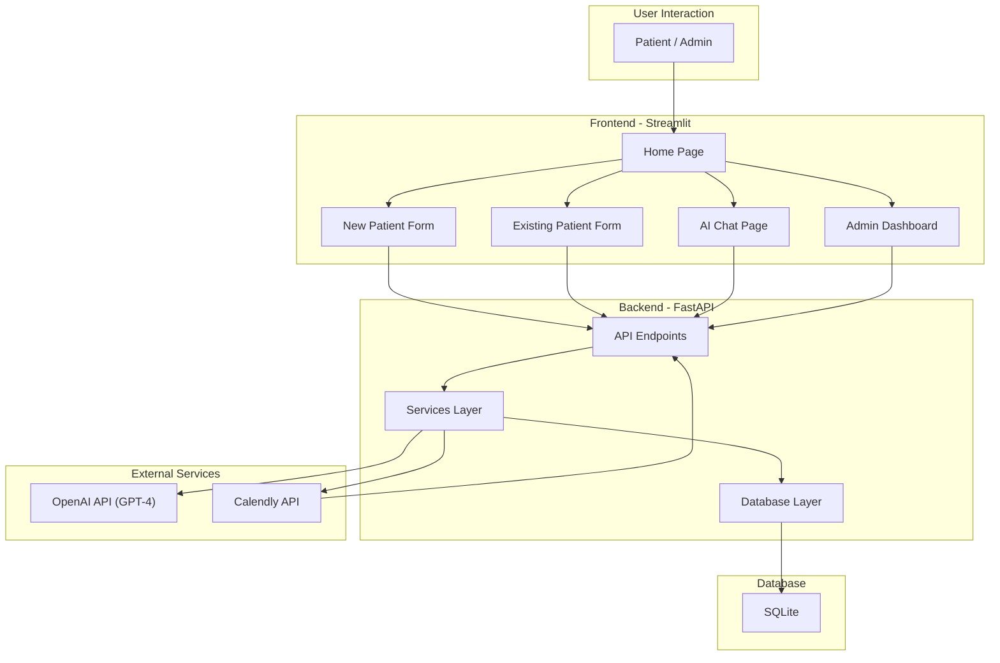

# **MediCare AI Appointment System**

An intelligent, multi-page medical appointment scheduling system designed to streamline the patient booking process. This application leverages AI for smart doctor recommendations, integrates seamlessly with Calendly for automated scheduling, and provides a conversational AI assistant for patient inquiries.

## **Core Features**

* **AI-Powered Doctor Recommendation**: Utilizes LangChain and GPT-4 to analyze a patient's symptoms and recommend the most suitable specialist from the available doctors.  
* **Automated Calendly Booking**: Embeds doctor-specific Calendly links directly into the user interface for a seamless booking experience.  
* **Real-time Webhook Integration**: Listens for Calendly webhooks (invitee.created, invitee.canceled) to instantly update the application's database with new or canceled appointments.  
* **Distinct Patient Workflows**: Provides separate, tailored user journeys for both new and existing patients.  
* **Conversational AI Assistant**: Features a chat page with a GPT-4 powered assistant that uses LangChain's ConversationBufferWindowMemory to remember the context of the conversation.  
* **Admin Dashboard**: A dedicated page for administrators to view scheduled appointments, filter them by doctor, and see patient information.  
* **Containerized Deployment**: Includes Dockerfile and docker-compose.yml for easy and reliable deployment.

## **System Architecture**

The application is built on a modern, decoupled architecture with a FastAPI backend serving a Streamlit frontend. This separation of concerns ensures scalability and maintainability.



## **Technical Deep Dive**

#### **1. Backend (FastAPI)**

The backend is the core of the application, handling all business logic, database interactions, and communication with external services.

* **app/main.py**: Defines all API endpoints, including /api/recommend-doctor, /api/chat, and the critical /webhooks/calendly.  
* **Service-Oriented Structure**: Logic is separated into services (ai_service.py, calendly_service.py) for better organization.  
* **Pydantic Models**: Used for robust data validation for both incoming requests and outgoing responses.

#### **2. Frontend (Streamlit)**

A multi-page application that provides a clean and interactive user interface.

* **frontend/app.py**: Contains the complete UI logic for all pages, using Streamlit's session state to manage user navigation and data persistence across pages.  
* **Dynamic UI**: The interface dynamically updates to show AI recommendations and embed the correct Calendly booking widgets.

#### **3. Database (SQLAlchemy & SQLite)**

* **app/database/models.py**: Defines the data structure with three core models: Patient, Doctor, and Appointment. The Patient model is comprehensive, capturing detailed information as requested.  
* **fake_data.py**: A script to populate the database with doctors, with some fully detailed dummy patients, and a set of fake appointments, making testing and demonstration easy.

#### **4. AI & LangChain Integration**

This is the "intelligent" part of the application.

* **Doctor Recommendation**: We use LangChain's .with_structured_output(PydanticModel) method. This forces the GPT-4 model to return a JSON object that perfectly matches our Pydantic DoctorRecommendation model, eliminating errors from unpredictable AI responses.  
* **AI Chat Assistant**: The chat page uses LangChain's ConversationChain combined with ConversationBufferWindowMemory. This gives the AI a "short-term memory" of the last few messages, allowing for natural, contextual follow-up questions.

#### **5. Calendly & Webhook Integration**

The integration is a two-way street:

1. **Outbound**: The application fetches the doctor's booking URL (calendly_new_patient_url, etc.) from the database and embeds it in the frontend.  
2. **Inbound (Webhooks)**: When a patient completes a booking on the Calendly page, Calendly's servers send a POST request to our /webhooks/calendly endpoint. Our application verifies the request's authenticity using a secret key and then creates or updates the appointment in our local database. This happens in real-time.

## **User Flows**

#### **New Patient Journey**

1. Selects "I am a New Patient".  
2. Fills out a detailed registration form, including symptoms.  
3. The backend receives the symptoms and uses the MedicalAIService to get a structured recommendation from GPT-4 for a specific doctor.  
4. The frontend displays the recommended doctor and their reasoning, then embeds the doctor's "New Patient" Calendly widget.  
5. The patient books a time. Upon successful booking, the Calendly webhook fires, and the appointment is logged in our database.

#### **Existing Patient Journey**

1. Selects "I am an Existing Patient".  
2. The application can be extended to include a lookup by email. The current implementation presents a list of doctors for direct follow-up booking.  
3. The patient selects their doctor, and the "Existing Patient" Calendly widget is displayed.  
4. The booking process and webhook functionality are the same as for a new patient.

#### **AI Chat Assistant**

1. The user navigates to the "Chat" page.  
2. A unique session ID is created and stored in the Streamlit session state.  
3. The user asks a question about the hospital, services, or doctors.  
4. The query and session ID are sent to the /api/chat endpoint.  
5. The MedicalAIService uses the corresponding ConversationChain (with its unique memory) to generate a contextual response from GPT-4.

#### **Admin Dashboard**

1. The admin navigates to the "Admin" page.  
2. The page fetches all appointments from the backend.  
3. The admin can use a dropdown menu to filter the displayed appointments by doctor, providing a quick overview of each doctor's schedule and patient load.

## **Local Setup & Deployment**

#### **Prerequisites**

* Python 3.9+  
* Git  

#### **1. Local Development**

1. **Clone the repository:**  
   ```bash
   git clone https://github.com/vinu0404/AI-Scheduling-Agent.git  
   cd AI-Scheduling-Agent
   ```

2. **Create and activate a virtual environment:**  
   ```bash
   python -m venv venv  
   source venv/bin/activate  # On Windows: venv\Scripts\activate
   ```

3. **Install dependencies:**  
   ```bash
   pip install -r requirements.txt
   ```

4. **Configure environment variables:**  
   * Copy the .env.example file to .env.  
   * Fill in all the required API keys and URLs in the .env file.  

5. **Initialize and seed the database:**  
   * **Important**: Delete any existing medical_appointments.db file and build the database:

   ```bash
   python -m app.database.init_db
   ```
   * Run the data geneartion script:
   ```bash
   python fake_data.py
   ```

6. **Run the application:**  
   * **Terminal 1 (Backend):**  
     ```bash
     python start_backend.py
     ```

   * **Terminal 2 (Frontend):**  
     ```bash
     python start_frontend.py
     ```

* Frontend will be available at http://localhost:8501.  
* Backend will be available at http://localhost:8000.

## **Environment Variables**

Create a .env file in the root directory and add the following variables:

| Variable | Description |
| :---- | :---- |
| OPENAI_API_KEY | Your secret API key from OpenAI. |
| CALENDLY_API_TOKEN | Your Personal Access Token from the Calendly developer portal. |
| CALENDLY_USER_URI | The URI of your Calendly user account. |
| CALENDLY_WEBHOOK_SECRET | A unique, secret string you create to secure your webhook endpoint. |
| DR_..._NEW_PATIENT_URL | The direct booking URL for a doctor's new patient event type. |
| DR_..._EXISTING_PATIENT_URL | The direct booking URL for a doctor's existing patient event type. |
| SMTP_SERVER | The server for your email provider (e.g., smtp.gmail.com). |
| SMTP_PORT | The port for your SMTP server (e.g., 587). |
| SMTP_USERNAME | Your email address for sending confirmations. |
| SMTP_PASSWORD | Your email app password (for Gmail, this is a 16-digit App Password). |
| FROM_EMAIL | The email address from which confirmations will be sent. |
| DATABASE_URL | The connection string for the database (default: sqlite:///./medical_appointments.db). |
| NGROK_URL | The public URL from ngrok for local webhook testing. |